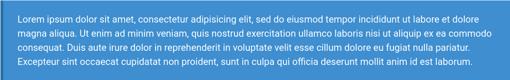

# bulma-blockquote
Adding color variations for the blockquotes following the Bulma CSS color scheme.


## Bulma version
At the moment of writing this, the most recent version of Bulma is [0.9.3](https://github.com/jgthms/bulma/releases/tag/0.9.3)


## How to use
### CSS file
You can download the repo or use a CDN, for example with JSDelivr

```
# Normal version
https://cdn.jsdelivr.net/gh/Lewatoto/bulma-blockquote/css/blockquote.css

# Minified version
https://cdn.jsdelivr.net/gh/Lewatoto/bulma-blockquote/css/blockquote.min.css
```

### HTML
The blockquote must to to be inside of a div with the `content` class, for example:
``` html
<div class='content'>
  <blockquote class='is-info'
    <p>Lorem ipsum dolor sit amet, consectetur adipisicing elit, sed do eiusmod tempor incididunt ut labore et dolore magna aliqua. Ut enim ad minim veniam, quis nostrud exercitation ullamco laboris nisi ut aliquip ex ea commodo consequat. Duis aute irure dolor in reprehenderit in voluptate velit esse cillum dolore eu fugiat nulla pariatur. Excepteur sint occaecat cupidatat non proident, sunt in culpa qui officia deserunt mollit anim id est laborum.</p>
  </blockquote>
</div>
```

This will be render as:
*Blockquote with Bulma is-info style*

### Avialable styles
Following the Bulma CSS color scheme, the options are:
- `is-white`
- `is-dark`
- `is-light`
- `is-dark`
- You have two version of this, one is only the name and the other you have to add the `is-light` class:
  - `is-primary`
  - `is-info`
  - `is-success`
  - `is-warning`
  - `is-danger`

### Important
This only change the background, border and text color, it does not affect elements like `<a> anchors`, for this you have to add your own styles or use [Bulma text color helpers](https://bulma.io/documentation/helpers/color-helpers/#text-color).

### Demo
You can see all the styles [here](https://lewatoto.github.io/estilos-blockquote-bulma-css/#ejemplos)

## Things to do
- [ ] Add a style for other elements inside the blockquotes.